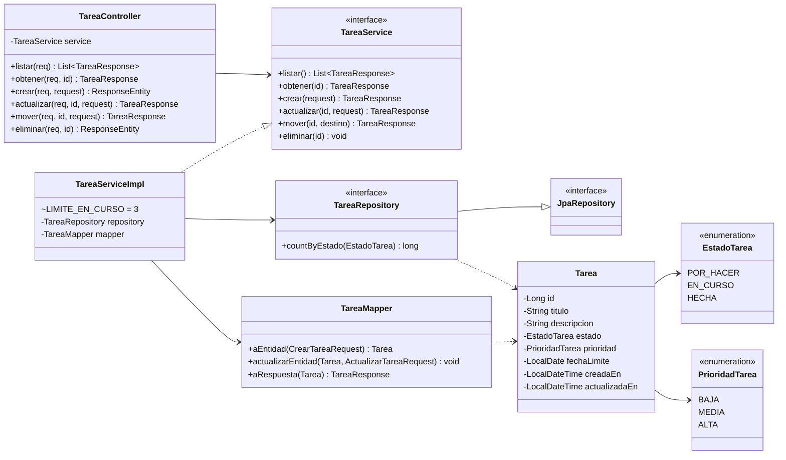
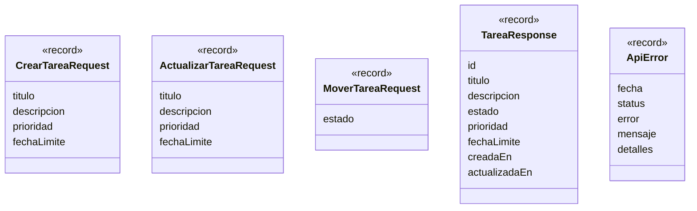
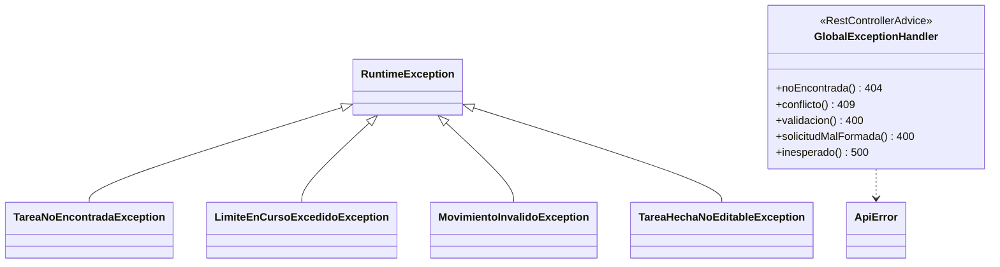
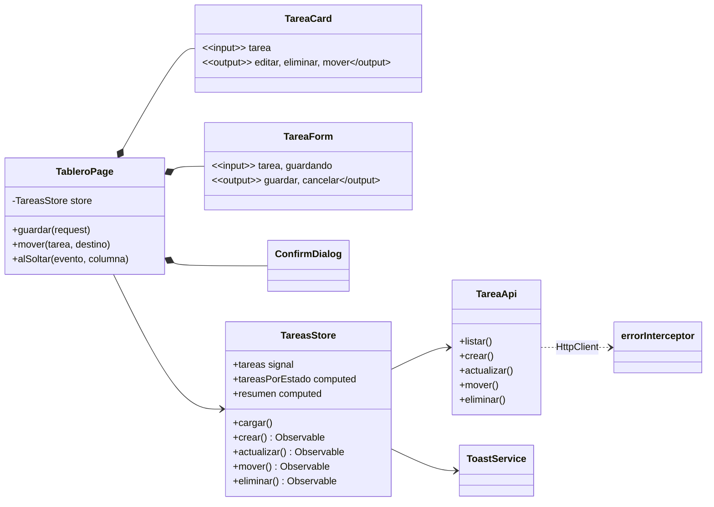

# 04 · UML de clases

Los diagramas están en Mermaid (en VS Code: extensión *Markdown Preview Mermaid Support*, `Ctrl+Shift+V`).

## Backend

```mermaid
classDiagram
    direction LR
    class TareaController {
        -TareaService service
        +listar(req) List~TareaResponse~
        +obtener(req, id) TareaResponse
        +crear(req, request) ResponseEntity
        +actualizar(req, id, request) TareaResponse
        +mover(req, id, request) TareaResponse
        +eliminar(req, id) ResponseEntity
    }
    class TareaService {
        <<interface>>
        +listar() List~TareaResponse~
        +obtener(id) TareaResponse
        +crear(request) TareaResponse
        +actualizar(id, request) TareaResponse
        +mover(id, destino) TareaResponse
        +eliminar(id) void
    }
    class TareaServiceImpl {
        ~LIMITE_EN_CURSO = 3
        -TareaRepository repository
        -TareaMapper mapper
    }
    class TareaMapper {
        +aEntidad(CrearTareaRequest) Tarea
        +actualizarEntidad(Tarea, ActualizarTareaRequest) void
        +aRespuesta(Tarea) TareaResponse
    }
    class TareaRepository {
        <<interface>>
        +countByEstado(EstadoTarea) long
    }
    class JpaRepository {
        <<interface>>
    }
    class Tarea {
        -Long id
        -String titulo
        -String descripcion
        -EstadoTarea estado
        -PrioridadTarea prioridad
        -LocalDate fechaLimite
        -LocalDateTime creadaEn
        -LocalDateTime actualizadaEn
    }
    class EstadoTarea {
        <<enumeration>>
        POR_HACER
        EN_CURSO
        HECHA
    }
    class PrioridadTarea {
        <<enumeration>>
        BAJA
        MEDIA
        ALTA
    }
    TareaController --> TareaService
    TareaServiceImpl ..|> TareaService
    TareaServiceImpl --> TareaRepository
    TareaServiceImpl --> TareaMapper
    TareaRepository --|> JpaRepository
    TareaRepository ..> Tarea
    TareaMapper ..> Tarea
    Tarea --> EstadoTarea
    Tarea --> PrioridadTarea
```

## DTO

```mermaid
classDiagram
    class CrearTareaRequest {
        <<record>>
        titulo
        descripcion
        prioridad
        fechaLimite
    }
    class ActualizarTareaRequest {
        <<record>>
        titulo
        descripcion
        prioridad
        fechaLimite
    }
    class MoverTareaRequest {
        <<record>>
        estado
    }
    class TareaResponse {
        <<record>>
        id
        titulo
        descripcion
        estado
        prioridad
        fechaLimite
        creadaEn
        actualizadaEn
    }
    class ApiError {
        <<record>>
        fecha
        status
        error
        mensaje
        detalles
    }
```

## Excepciones

```mermaid
classDiagram
    RuntimeException <|-- TareaNoEncontradaException
    RuntimeException <|-- LimiteEnCursoExcedidoException
    RuntimeException <|-- MovimientoInvalidoException
    RuntimeException <|-- TareaHechaNoEditableException
    class GlobalExceptionHandler {
        <<RestControllerAdvice>>
        +noEncontrada() 404
        +conflicto() 409
        +validacion() 400
        +solicitudMalFormada() 400
        +inesperado() 500
    }
    GlobalExceptionHandler ..> ApiError
```

## Frontend (Angular)

```mermaid
classDiagram
    direction LR
    class TableroPage {
        -TareasStore store
        +guardar(request)
        +mover(tarea, destino)
        +alSoltar(evento, columna)
    }
    class TareaCard {
        <<input>> tarea
        <<output>> editar, eliminar, mover
    }
    class TareaForm {
        <<input>> tarea, guardando
        <<output>> guardar, cancelar
    }
    class ConfirmDialog
    class TareasStore {
        +tareas signal
        +tareasPorEstado computed
        +resumen computed
        +cargar()
        +crear() Observable
        +actualizar() Observable
        +mover() Observable
        +eliminar() Observable
    }
    class TareaApi {
        +listar()
        +crear()
        +actualizar()
        +mover()
        +eliminar()
    }
    class ToastService
    class errorInterceptor
    TableroPage --> TareasStore
    TableroPage *-- TareaCard
    TableroPage *-- TareaForm
    TableroPage *-- ConfirmDialog
    TareasStore --> TareaApi
    TareasStore --> ToastService
    TareaApi ..> errorInterceptor : HttpClient
```
